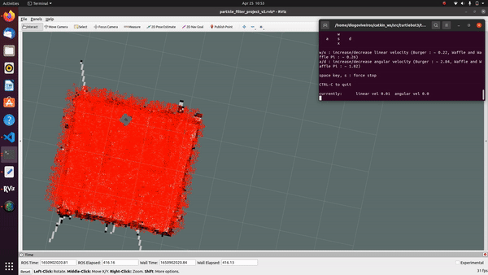

# Particle Filter Project

Diogo Viveiros & Sam Shatzkin

## Implementation Plan

- initialize_particle_cloud: We will initialize our particle cloud by mapping our environment with SLAM initially. Afterwards, we will place an extremely large amount of particles throughout this environment, essentially "filling" this space with randomly distributed particles which we can then use to estimate the robot's position later.
- update_particles_with_motion_model: In order to update the position of the particles, we will use a similar methodology utilized in class when learning the Monte Carlo Localization method. Therefore, we will move these particles in the direction where the particle is facing, and then get the new hypothetical location for that particle.
- update_particle_weights_with_measurement_model: We will compute the importance weights of each particle by  comparing the robot's sensor readings to the estimated ones from the particle. Each particle will have it's own weight calculated by summing up the difference, taking the absolute value, and then getting the inverse.
- normalize_particles/ resample_particles: We will normalize these weights by adding up all of the probabilities, and then divide this sum by a number that will give us 1. We will then resample by using a random sampling algorithm that is probabilistically proportion to the weights.
- update_estimated_robot_pose: Then, we will update the estimated pose of the robot by running a series of tests to determine how cmd_vel instructions relate to change in position of the robot. Additionally, we'll use the robot's odometry data to help us estimate more accurate positions of the robot.
- Noise: We will incorporate noise into our particle filter localization by adding some slight offsets to our final estimations in each step, with the goal of trying to get the particles incrementally closer to the  actual position as possible.

## Proposed Timeline

- initialize_particle_cloud: Done by April 15th
- update_particles_with_motion_model: Done by April 20th
- pdate_particle_weights_with_measurement_model: Done by April 22nd
- normalize_particles & resample_particles: Done by April 22nd
- update_estimated_robot_pose: Done by April 24th
- Noise: Done by April 20th
- Testing and Refinement: From 24th to 26th

## Objectives description

 The goal of this project was to implement a particle localization filter which finds and follows the location of the turtlebot on a map of the maze that it currently inhabits.

## High-level description

Our approach starts with 10,000 particles randomly distributed accross the map, each representing a possible position and orientation of the robot. Each time that the robot's movement threshold is reached, we first move each particle corresponding with the movement of the robot, and we use a likelihood field algorithm to compare the measurements of the robot's sensors in 8 directions to the simulated measurements that would be returned if the robot was at each of our 10,000 proposed locations. Each particle is weighted according to the similartiy of its simulated measurements to the actual measurements, and then particles are resampled according to this weight. By repeating these steps, and adding noise in the movement and resampling steps, we lead the particles to converge into a cluster on the robot's actual location.

## Project Components

### Initialization of particle cloud

  We initialize our particle cloud in the __initialize_particle_cloud__ function provided to us as part of the __ParticleFilter__ class. (Lines 167-188)

  Our particle cloud initialization code generates 10,000 particles at random locations within the bounds of our maze map with random yaw rotations. Each of these particles is assigned the weight "1", and then normalize particles is called to ensure the weights of all particles sum to 1, before publishing them.

### Movement model

 Our movement model is contained within two functions: **movement_model** (a helper function that starts on line 38) and **update_particles_with_motion_model** which starts on line 409. Update_particles_with_motion_model starts by reading the odometry data and creating a delta in the x and y coordinates to figure out how much its position it changes. We also store the old and the new yaws that the odometry data provides us in order to then implement our movement model precisely. We decided that the best way to update the particles' motions was to use a "Rotate, Move, Rotate" movement model as from our lessons that seemed to most consistently provide the most accurate results when there were motion updates that occurred when the robot didn't merely go completely straight in the x or y direction. All of the movement model is implemented in the helper function, whre we calculate the first rotation but taking the arc tangent of the x and y movement and then subtracting it by the old yaw. We then use the distance formula to calculate the translation, and calculate the second rotation but taking the current yaw of the robot, and subtracting it from the amount we've already rotated and the old yaw of the robot. We then apply this formula to all the particles in our map, while also introducing some slight sampling noise to ensure thaty won't cluster in  exactly the same spot. 

### Measurement model

  Our measurement model is update in the __update_particle_weights_with_measurement_model__ function. (Line 370) We update our measurement model using the likelihood field approach, using functions defined in the external likelihood_field.py file provided to us during the in-class likelihood field exercise. Additionally, we duplicated the function __compute_prob_zero_centered_gaussian__ from the class exercise into our particle_filter.py document.

  Our __update_particle_weights_with_measurement_model__ function takes the most recent LIDAR range data from the robot, and uses the likelihood field algorithm to calculate the likelihood that each particle would return this LIDAR data given its position and orientation in the map. This probability is used to assign each particle a weight, which will impact that particle's chances of being resampled.

  More specifically, we projected LIDAR data in 8 directions (at 45 degree increments from each other) for each particle, and retrieved the distance to the nearest obstacle to each of these projected beams using likelihood field functions. The __compute_prob_zero_centered_gaussian__ is paramaterized with these distances and with 0.1, and we use the result of this function to update the new weight that is assigned to each particle.

### Resampling

  Our resampling step happens in two functions, __resample_particles__ (line 246) and __draw_random_sample__ (line 66), which is called by __resample particles__.

  The first step to __resample_particles__ is a call to __draw_random_sample__, a function which collects a weighted random sample of 10,000 particles from the existing particle cloud.

  The next step is to add a small amount of noise to these collected particles, to ensure that we maintain diversity in the positions and orientations of the particles before the next update round.

  Finally we update the particle cloud to be equal to this new array of noisy, resampled particles that have been generated.

### Incorporation of noise

We incorporate noise at two steps in the project, during our movement update step in __movement_model__(line 38), and during our resampling step in __resample_particles__(line 246).

In our movement model, we used a turn-move-turn approach, and added noise to each of the rotations and forward movements. Often, this noise is lost in the resampling process, because when a single point is sampled many times, the final sample loses a lot of this noise. We found our results to be best when we added a little more noise back after the resampling phase, to ensure that the published particle cloud always contained a cloud of slightly different particles.

### Updating estimated robot pose

The estimated robot pose is updated in function __update_estimated_robot_pose__ (line 351).

In order to update the estimated robot pose, we take the average of the x and y coordinates of every particle in the cloud, as well as the average of the yaw of every particle in the cloud. We assign the estimated robot pose to this average position and orientation.

### Optimization of parameters

## Challenges

We believe that the most challenging parts of these assigments were to implement the likelihood field and the "Move, Rotate, Move" algorithms that we learned in class. Particularly the likelihood field required a lot of study and analysis of the website and slides in order to fully understand all the steps and to make sure we weren't doing any of them wrong or skipping them altogether. The movement model also took some analysis as there were certain elements in the algorithm, such as understanding the role of the arctangent function and the sampling, which took a while to understand. We also had some smaller issues that were a bit tricky to solve in the form of bugs. For example, we spent a lot of time understanding how to create a Quaternion, as we didn't initially understand that the function euler_to_quaternion doesn't return a quaternion, but rather an array which then allows us to initialize a Quaternion variable. Figuring out in which functions we should add noise to also took a while. We also encountered a Python bug that took us a few hours to solve where we were doing particle.weight instead of particle.w, meaning our weights weren't actually updating. We also found it intellectually challenging to tune the parameters, but actually did quite well. 

## Future work

Given more time, we would to create a function that would programatically identify where the map was located and fill that area with particles, as we currently had to manually adjust where the particles would populate based on where the map was located and its size. Doing it programatically would be really cool because then we could automatically load any map in and the particle field would work instantly! Right now, we need to change a few paramaters to make sure the clustering is as good as possible for our specific map. We also think it would be good to find ways to reduce the time it takes for the robot to move and for the particles to update, whether that would mean changing some parameters like the ovement threshold or trying to find the optimal number of particles that gives accurate locations but doesn't hog a lot of computer resources.

## Takeaways

 - Quaternions are interesting mathematical objects that allow us to store yaw and rotational data for our robot and its estimation particles. Setting them up can be a bit tricky at first, requiring us to get an array from euler_to_quaternion and then setting those elements to a Quaternion variable.
 - Likelihood fields are really, really, good at estimating likely positions of robots when we are going around objects such as walls. After implementing the likelihood field, we immediately noticed that the clustering was much tighter around regions like walls if the robot was also near a wall, and any movement afterwards would quickly change the cluster to the right area almost always.
 - A "Rotate, Move, Rotate" movement model for particle estimation is one of the most ideal as it can account for rotational movements quite well while still remaining fairly close to the robot. However, it will never be exactly in the same position as the robot itself, which is a good reminder that these particle estimations are just that, estimations. They will never be fully perfect.
 - A particle filter is still dependent on us knowing the environment, which in this case we mapped with SLAM. It works extremely well in a non-foreign environment, but would be extremely unlikely to be effective in maps which are very unknown. We would need more advanced tracking methodologies such as SLAM running in real-time or some kind of GPS tracking in order to locate our robots in these scenarios.